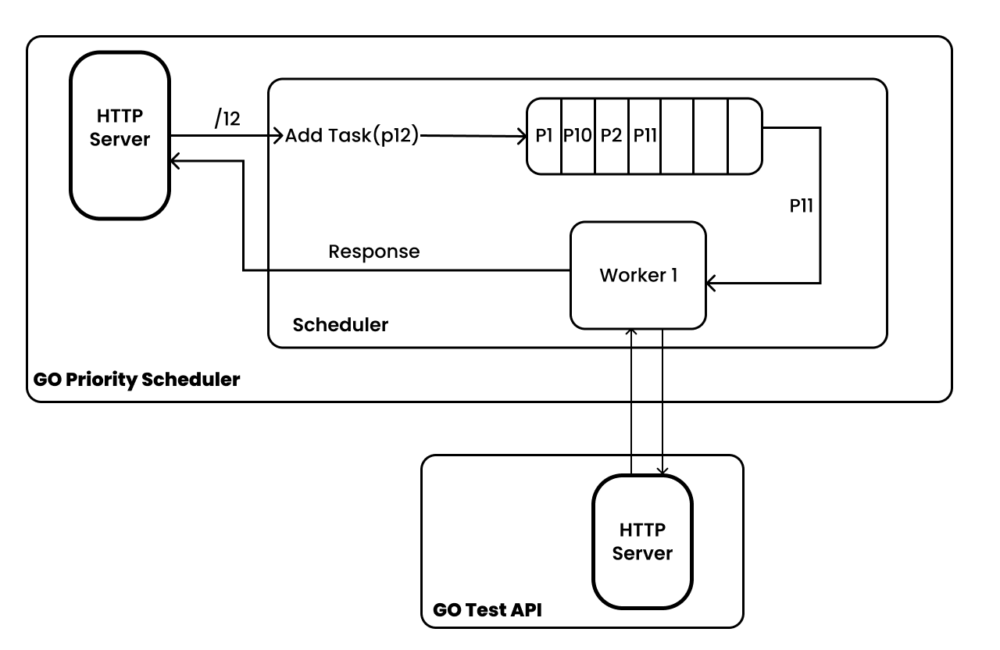

# Priority Scheduling in CPU Core Constrained Environment

This Go application has a priority scheduler with a time-based priority increment feature. The time-based priority-increment feature prevents starvation of tasks when there is an overwhelming number of high-priority tasks.

This application can take any level of priority. Send requests to `http:localhost:8000/<priority-level>`. The `priority-level` parameter is a number, the higher the value, the higher the priority.

## Running the application locally
As you can see there are 2 folders in the root directory, GoPriorityScheduling & Go-testAPI. The Go-testAPI is an HTTP Server that acts as a DB.

Start the Go-testAPI first:
1. `cd Go-testAPI`
2. `go run main.go`

In another terminal start the GoPriorityScheduling:
1. `cd GoPriorityScheduling`
2. `go run main.go` 

## How it works

Tasks are created when a request comes in with a priority level. Once a task is created it is then pushed to the queue. A worker Goroutine is running in the background. This worker executes tasks. You can increase the number of workers. 
I've tried to maintain a M:M cardinality for M equal to the number of cores available, in my case, 1(to replicate the number of goroutines). Reducing the number of workers increases the response time and increasing the number of workers to match your cores will reduce the response time.
The worker then sends an HTTP request to the Test-API, in order to replicate a complex & time-consuming DB operation, the response will take a minimum of 4 Seconds.

The Worker is constantly listening to the Task queue by calling the `getNextTask()` function. This function will first check the age of the task, for every 5 seconds a task spends in the queue, its priority is incremented.